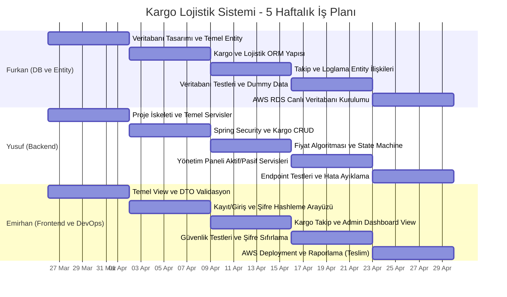

```mermaid
gantt
title Kargo Lojistik Sistemi - 5 Haftalık İş Planı
dateFormat  YYYY-MM-DD
axisFormat  %d %b
    
section Furkan (DB ve Entity)
Veritabanı Tasarımı ve Temel Entity      :a1, 2026-03-26, 7d
Kargo ve Lojistik ORM Yapısı            :a2, after a1, 7d
Takip ve Loglama Entity İlişkileri      :a3, after a2, 7d
Veritabanı Testleri ve Dummy Data       :a4, after a3, 7d
AWS RDS Canlı Veritabanı Kurulumu       :a5, after a4, 7d

section Yusuf (Backend)
Proje İskeleti ve Temel Servisler       :b1, 2026-03-26, 7d
Spring Security ve Kargo CRUD           :b2, after b1, 7d
Fiyat Algoritması ve State Machine      :b3, after b2, 7d
Yönetim Paneli Aktif/Pasif Servisleri   :b4, after b3, 7d
Endpoint Testleri ve Hata Ayıklama      :b5, after b4, 7d

section Emirhan (Frontend ve DevOps)
Temel View ve DTO Validasyon            :c1, 2026-03-26, 7d
Kayıt/Giriş ve Şifre Hashleme Arayüzü   :c2, after c1, 7d
Kargo Takip ve Admin Dashboard View     :c3, after c2, 7d
Güvenlik Testleri ve Şifre Sıfırlama    :c4, after c3, 7d
AWS Deployment ve Raporlama (Teslim)    :c5, after c4, 7d
```
